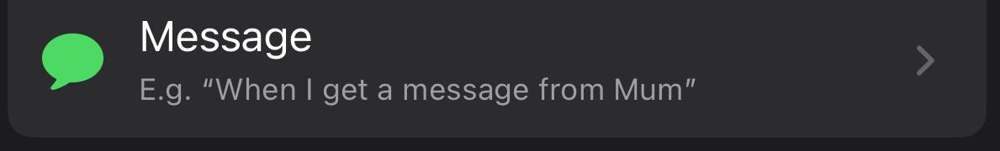
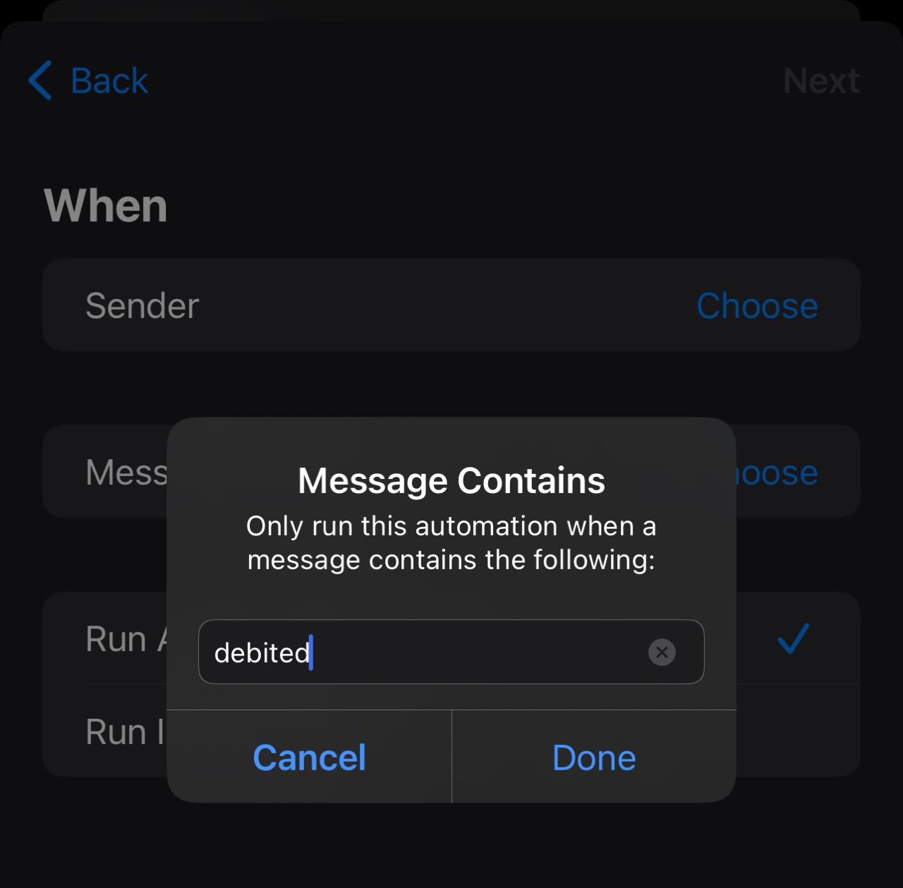
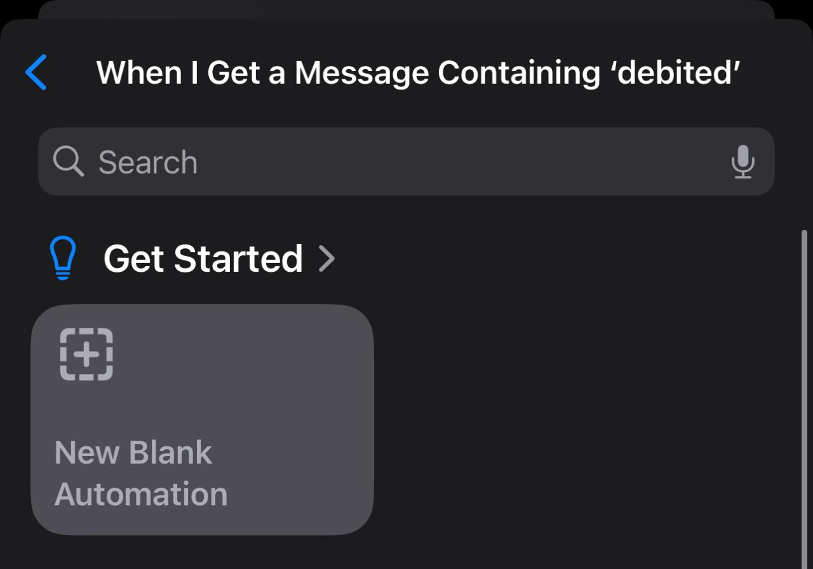
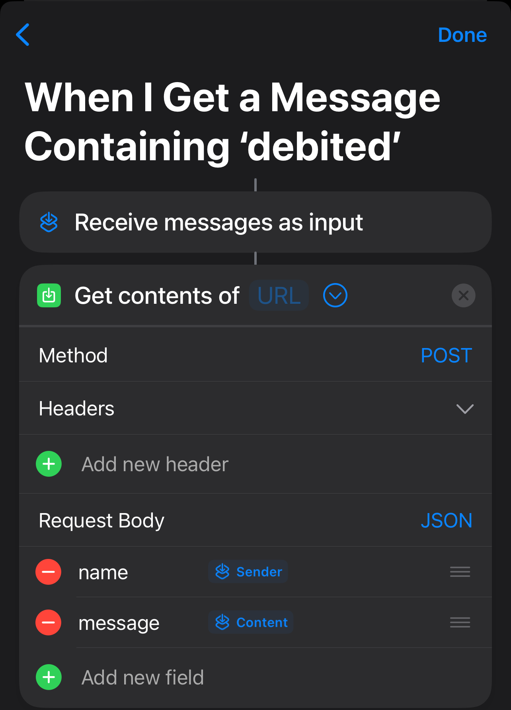

# The Expense Diary

The Expense Diary is a simple tool that helps you track your expenses.

## Thinking about what is unique in this

> [!CAUTION]
## This is not some ordinary Expense Tracker !!, 

### This system extracts messages from your iPhone that contain keywords such as 'spent,' 'debited,' or 'credited.' It then uses the OpenAI API in the Spring Boot backend to convert these messages into a JSON object, stores the data in a mongodb database, and allows you to view it through a React application.

### 1. Shows the recent transactions on the top with red symbolising debited and green symbolising credited
### 2. Allows you to add new transactions by sending a message to your iPhone
### 3. Shows visualisations of your spends with graphs with featue of seeing Yearly, Monthly, Weekly, and DayWise and with this also shows the TotalMoney out/in with Net profit or loss for the selected time period
### 4. Also have a search feature by which you can search according to names, paymentMode, date, debited or credited in your transactions

## How to Set up

## How to get the message from iPhone
You need to have the following setup on your iPhone
> 1. Go to Shortcuts>Automation
> 2. Create a new automation
>  
>  
> 3. Click on Message
>  
>  
>  
> 4. Add the message "debited","spent"
>  
>  
>  
> 5. Click On create new blank Automation
>  
> ! 
> 6. Click on add action
> 7. Click on Web>Get Content of URL
> 8. change request method to post
> 9. change the request body to the following
>  
> ! 
> 10. The url will consist of the hosted SpringBoot backend connected to MongoDb databse

## MongoDB
1. Create a new MongoDB database
2. Create a new Collection

## Spring Boot backend
1. Get the backend from the The-Expense-Diary-Mark-1_Backend
2. In the application.properties file
add your mongodb database credentials and the OpenAi APIKEY
3. Run the backend

## React Frontend 
1. Get the frontend from The-Expense-Diary-Mark-1_Frontend
2. Change the axios requests URL to your hosted backened URL or the localhost
3. Run the frontend

Output will look like this
(https://drive.google.com/file/d/1APdmivyWeoaqdHL1m4bgF3YN4xwHMKg-/view?usp=drive_link)

Thanks for dropping by!!

